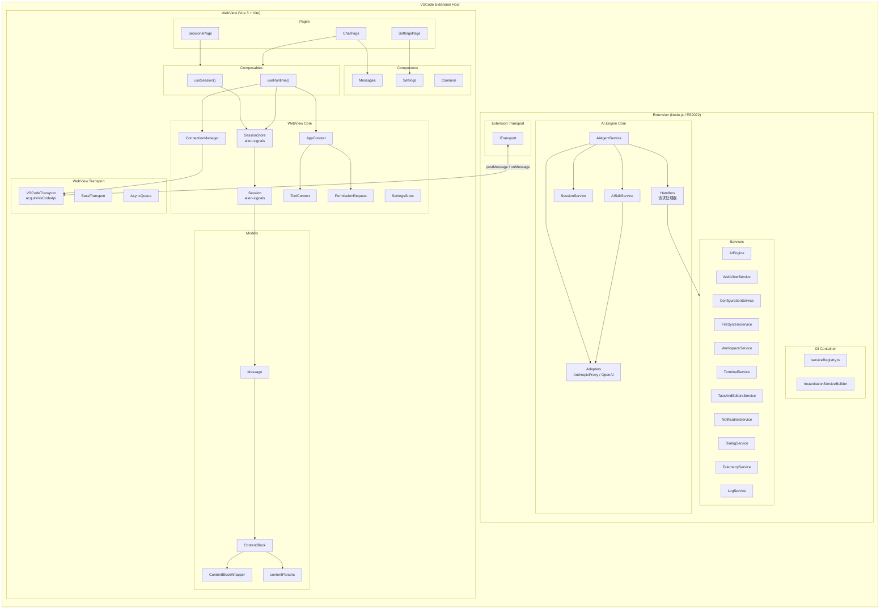
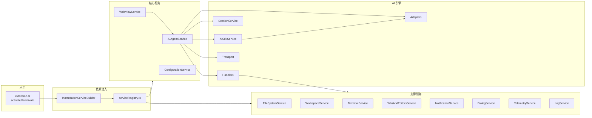
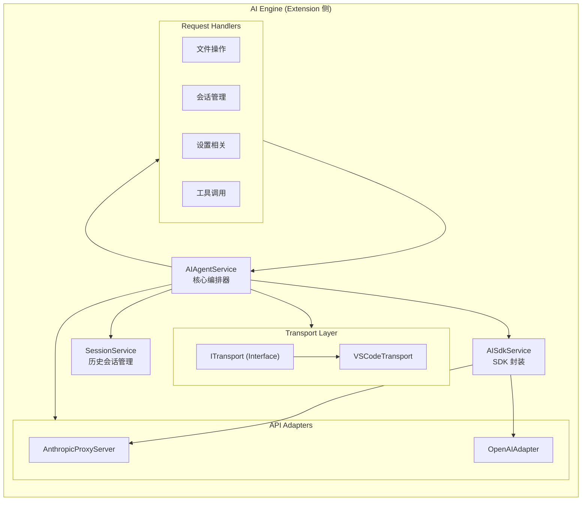
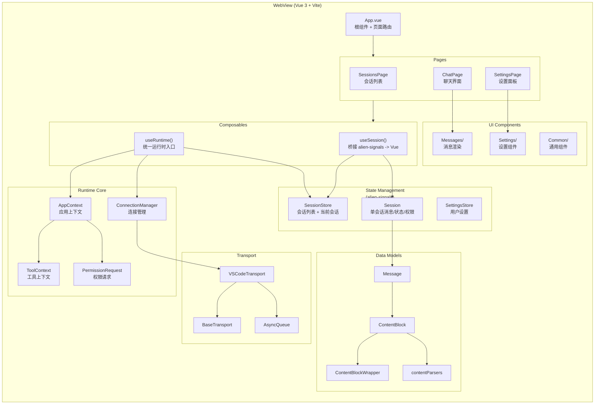
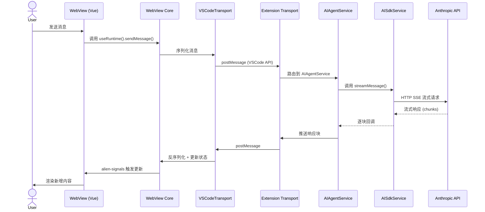
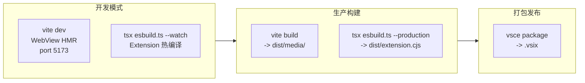
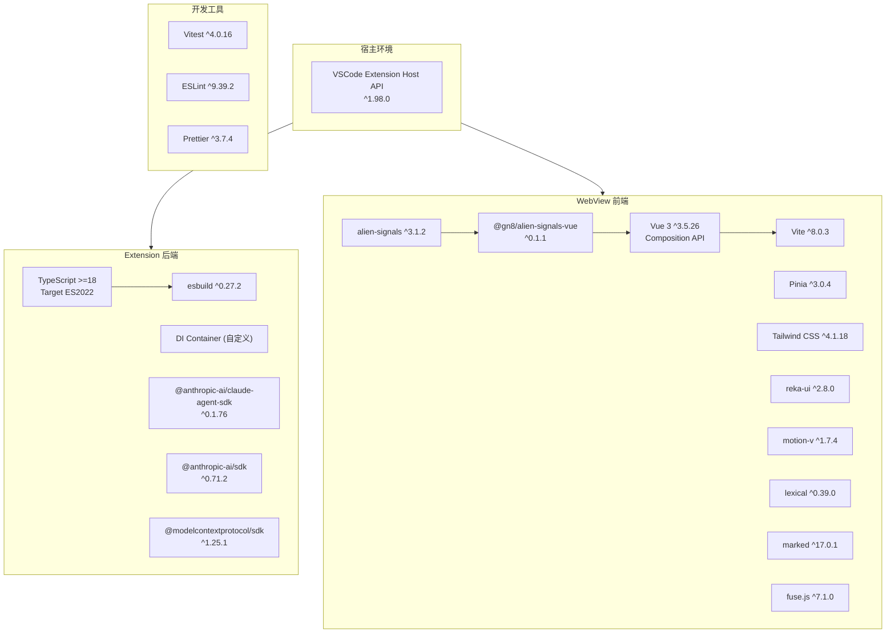

# YWCoder 项目架构图

## 1. 整体架构

```mermaid
flowchart TB
    subgraph VSCode["VSCode Extension Host"]
        direction TB

        subgraph Ext["Extension (Node.js / ES2022)"]
            direction TB

            subgraph DI["DI Container"]
                Registry["serviceRegistry.ts"]
                Builder["InstantiationServiceBuilder"]
            end

            subgraph SVCS["Services"]
                AI["AIEngine"]
                WV["WebViewService"]
                CFG["ConfigurationService"]
                FS["FileSystemService"]
                WS["WorkspaceService"]
                TM["TerminalService"]
                TE["TabsAndEditorsService"]
                NS["NotificationService"]
                DLG["DialogService"]
                TL["TelemetryService"]
                LOG["LogService"]
            end

            subgraph AI_CORE["AI Engine Core"]
                Agent["AIAgentService"]
                SDK["AISdkService"]
                SessSvc["SessionService"]
                Adapters["Adapters<br/>AnthropicProxy / OpenAI"]
                Handlers["Handlers<br/>请求处理器"]
            end

            subgraph EXT_TRANSP["Extension Transport"]
                ET["ITransport"]
            end
        end

        subgraph WV_LAYER["WebView (Vue 3 + Vite)"]
            direction TB

            subgraph PAGES["Pages"]
                PG_SESSIONS["SessionsPage"]
                PG_CHAT["ChatPage"]
                PG_SETTINGS["SettingsPage"]
            end

            subgraph COMP["Components"]
                MSG["Messages"]
                SETT["Settings"]
                COMM["Common"]
            end

            subgraph CORE["WebView Core"]
                Conn["ConnectionManager"]
                SS["SessionStore<br/>alien-signals"]
                SE["Session<br/>alien-signals"]
                ST["SettingsStore"]
                AC["AppContext"]
                TC["ToolContext"]
                PR["PermissionRequest"]
            end

            subgraph WV_TRANSP["WebView Transport"]
                BT["BaseTransport"]
                VT["VSCodeTransport<br/>acquireVsCodeApi"]
                AQ["AsyncQueue"]
            end

            subgraph MODELS["Models"]
                M_MSG["Message"]
                M_CB["ContentBlock"]
                M_CW["ContentBlockWrapper"]
                M_CP["contentParsers"]
            end

            subgraph COMP_API["Composables"]
                useSess["useSession()"]
                useRT["useRuntime()"]
            end
        end
    end

    ET <-->|"postMessage / onMessage"| VT
    Agent --> SDK
    Agent --> SessSvc
    Agent --> Adapters
    Agent --> Handlers
    Handlers --> SVCS
    SDK --> Adapters
    Conn --> VT
    SS --> SE
    useSess --> SS
    useRT --> Conn
    useRT --> SS
    useRT --> AC
    PG_CHAT --> MSG
    PG_SETTINGS --> SETT
    PG_SESSIONS --> COMP_API
    PG_CHAT --> COMP_API
    SE --> M_MSG
    M_MSG --> M_CB
    M_CB --> M_CW
    M_CB --> M_CP
    AC --> TC
    AC --> PR
```

---

## 2. Extension 侧服务依赖关系

```mermaid
flowchart LR
    subgraph Entry["入口"]
        EXT["extension.ts<br/>activate/deactivate"]
    end

    subgraph DI["依赖注入"]
        Builder["InstantiationServiceBuilder"]
        Reg["serviceRegistry.ts"]
    end

    subgraph CoreSvc["核心服务"]
        AI["AIAgentService"]
        WebV["WebViewService"]
        Conf["ConfigurationService"]
    end

    subgraph SupSvc["支撑服务"]
        FS["FileSystemService"]
        WS["WorkspaceService"]
        TM["TerminalService"]
        TE["TabsAndEditorsService"]
        NS["NotificationService"]
        DLG["DialogService"]
        TL["TelemetryService"]
        LOG["LogService"]
    end

    subgraph AI_Engine["AI 引擎"]
        SDK["AISdkService"]
        Sess["SessionService"]
        Adp["Adapters"]
        Hdl["Handlers"]
        Tran["Transport"]
    end

    EXT --> Builder
    Builder --> Reg
    Reg --> CoreSvc
    Reg --> SupSvc
    AI --> SDK
    AI --> Sess
    AI --> Adp
    AI --> Hdl
    AI --> Tran
    Hdl --> SupSvc
    SDK --> Adp
    WebV --> AI
```

---

## 3. AI 引擎内部架构

```mermaid
flowchart TB
    subgraph AIEngine["AI Engine (Extension 侧)"]
        direction TB

        Agent["AIAgentService<br/>核心编排器"]

        subgraph Adapters["API Adapters"]
            Anth["AnthropicProxyServer"]
            OAI["OpenAIAdapter"]
        end

        subgraph Transport["Transport Layer"]
            ITran["ITransport (Interface)"]
            VSCTran["VSCodeTransport"]
        end

        subgraph Handlers["Request Handlers"]
            H_FILE["文件操作"]
            H_SESS["会话管理"]
            H_SETT["设置相关"]
            H_TOOL["工具调用"]
        end

        SDK["AISdkService<br/>SDK 封装"]
        SessSvc["SessionService<br/>历史会话管理"]
    end

    Agent --> SDK
    Agent --> SessSvc
    Agent --> Adapters
    Agent --> Handlers
    Agent --> Transport

    SDK --> Anth
    SDK --> OAI
    ITran --> VSCTran
    Handlers --> Agent
```

---

## 4. WebView 侧前端架构

```mermaid
flowchart TB
    subgraph WebView["WebView (Vue 3 + Vite)"]
        direction TB

        App["App.vue<br/>根组件 + 页面路由"]

        subgraph Pages["Pages"]
            P1["SessionsPage<br/>会话列表"]
            P2["ChatPage<br/>聊天界面"]
            P3["SettingsPage<br/>设置面板"]
        end

        subgraph UI["UI Components"]
            C1["Messages/<br/>消息渲染"]
            C2["Settings/<br/>设置组件"]
            C3["Common/<br/>通用组件"]
        end

        subgraph StateMgmt["State Management<br/>(alien-signals)"]
            SS["SessionStore<br/>会话列表 + 当前会话"]
            SE["Session<br/>单会话消息/状态/权限"]
            ST["SettingsStore<br/>用户设置"]
        end

        subgraph Runtime["Runtime Core"]
            CM["ConnectionManager<br/>连接管理"]
            AC["AppContext<br/>应用上下文"]
            TC["ToolContext<br/>工具上下文"]
            PR["PermissionRequest<br/>权限请求"]
        end

        subgraph Transp["Transport"]
            BT["BaseTransport"]
            VT["VSCodeTransport"]
            AQ["AsyncQueue"]
        end

        subgraph DataModel["Data Models"]
            DM1["Message"]
            DM2["ContentBlock"]
            DM3["ContentBlockWrapper"]
            DM4["contentParsers"]
        end

        subgraph Composables["Composables"]
            U1["useSession()<br/>桥接 alien-signals -> Vue"]
            U2["useRuntime()<br/>统一运行时入口"]
        end

        App --> Pages
        P2 --> C1
        P3 --> C2
        Pages --> Composables
        U1 --> SS
        U1 --> SE
        U2 --> CM
        U2 --> SS
        U2 --> AC
        CM --> VT
        VT --> BT
        VT --> AQ
        SE --> DM1
        DM1 --> DM2
        DM2 --> DM3
        DM2 --> DM4
        AC --> TC
        AC --> PR
    end
```

---

## 5. 数据流与通信协议

```mermaid
sequenceDiagram
    actor User
    participant WebView as WebView (Vue)
    participant WVCore as WebView Core
    participant WVTrans as VSCodeTransport
    participant EXTTrans as Extension Transport
    participant Agent as AIAgentService
    participant SDK as AISdkService
    participant AI as Anthropic API

    User->>WebView: 发送消息
    WebView->>WVCore: 调用 useRuntime().sendMessage()
    WVCore->>WVTrans: 序列化消息
    WVTrans->>EXTTrans: postMessage (VSCode API)
    EXTTrans->>Agent: 路由到 AIAgentService
    Agent->>SDK: 调用 streamMessage()
    SDK->>AI: HTTP SSE 流式请求
    AI-->>SDK: 流式响应 (chunks)
    SDK-->>Agent: 逐块回调
    Agent->>EXTTrans: 推送响应块
    EXTTrans->>WVTrans: postMessage
    WVTrans->>WVCore: 反序列化 + 更新状态
    WVCore->>WebView: alien-signals 触发更新
    WebView->>User: 渲染新增内容
```

---

## 6. 构建流程

```mermaid
flowchart LR
    subgraph Dev["开发模式"]
        D1["vite dev<br/>WebView HMR<br/>port 5173"]
        D2["tsx esbuild.ts --watch<br/>Extension 热编译"]
    end

    subgraph Build["生产构建"]
        B1["vite build<br/>-> dist/media/"]
        B2["tsx esbuild.ts --production<br/>-> dist/extension.cjs"]
    end

    subgraph Package["打包发布"]
        P1["vsce package<br/>-> .vsix"]
    end

    Dev --> Build
    Build --> Package
```

---

## 7. 技术栈全景

```mermaid
flowchart TB
    subgraph Host["宿主环境"]
        VS["VSCode Extension Host API<br/>^1.98.0"]
    end

    subgraph Backend["Extension 后端"]
        TS["TypeScript >=18<br/>Target ES2022"]
        ES["esbuild ^0.27.2"]
        DI["DI Container (自定义)"]
        SDK1["@anthropic-ai/claude-agent-sdk<br/>^0.1.76"]
        SDK2["@anthropic-ai/sdk<br/>^0.71.2"]
        MCP["@modelcontextprotocol/sdk<br/>^1.25.1"]
    end

    subgraph Frontend["WebView 前端"]
        VUE["Vue 3 ^3.5.26<br/>Composition API"]
        VITE["Vite ^8.0.3"]
        PIN["Pinia ^3.0.4"]
        SIG["alien-signals ^3.1.2"]
        SIGVUE["@gn8/alien-signals-vue<br/>^0.1.1"]
        TW["Tailwind CSS ^4.1.18"]
        REKA["reka-ui ^2.8.0"]
        MOTION["motion-v ^1.7.4"]
        LEX["lexical ^0.39.0"]
        MARK["marked ^17.0.1"]
        FUSE["fuse.js ^7.1.0"]
    end

    subgraph DevTools["开发工具"]
        VT["Vitest ^4.0.16"]
        ESL["ESLint ^9.39.2"]
        PRE["Prettier ^3.7.4"]
    end

    Host --> Backend
    Host --> Frontend
    TS --> ES
    VUE --> VITE
    SIG --> SIGVUE
    SIGVUE --> VUE
```
